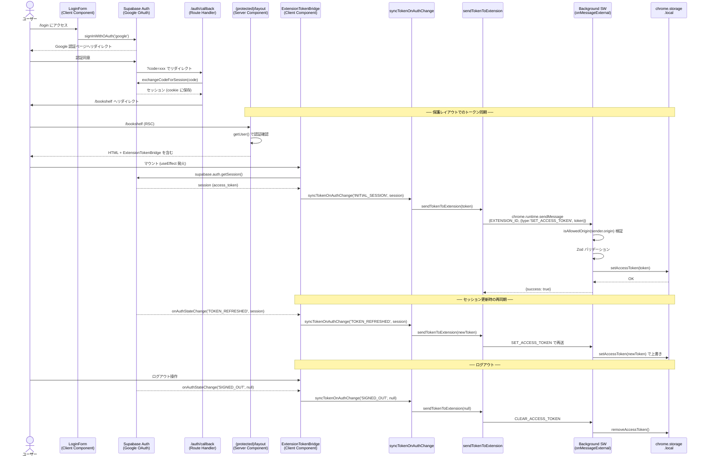
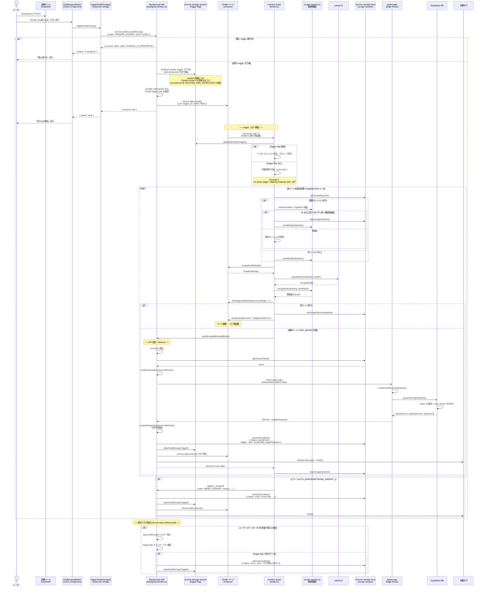
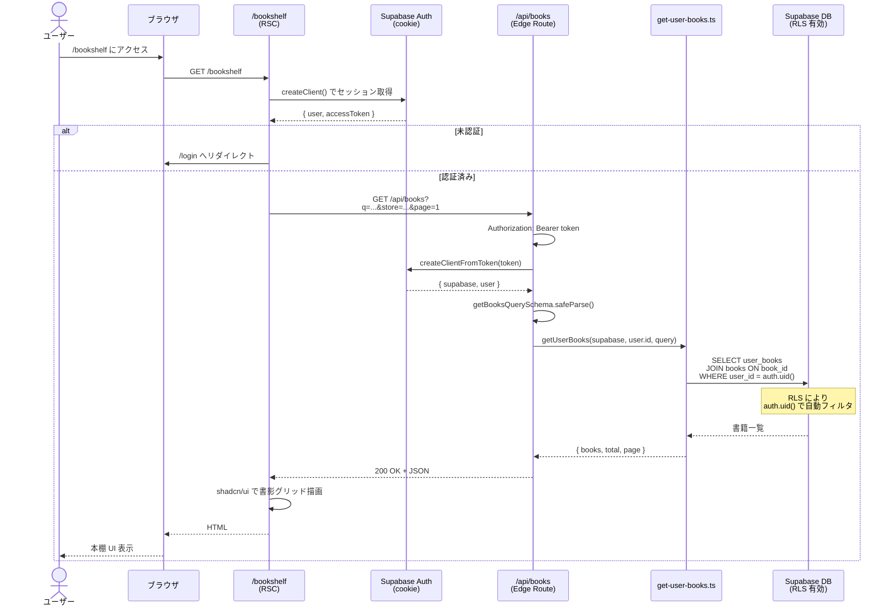
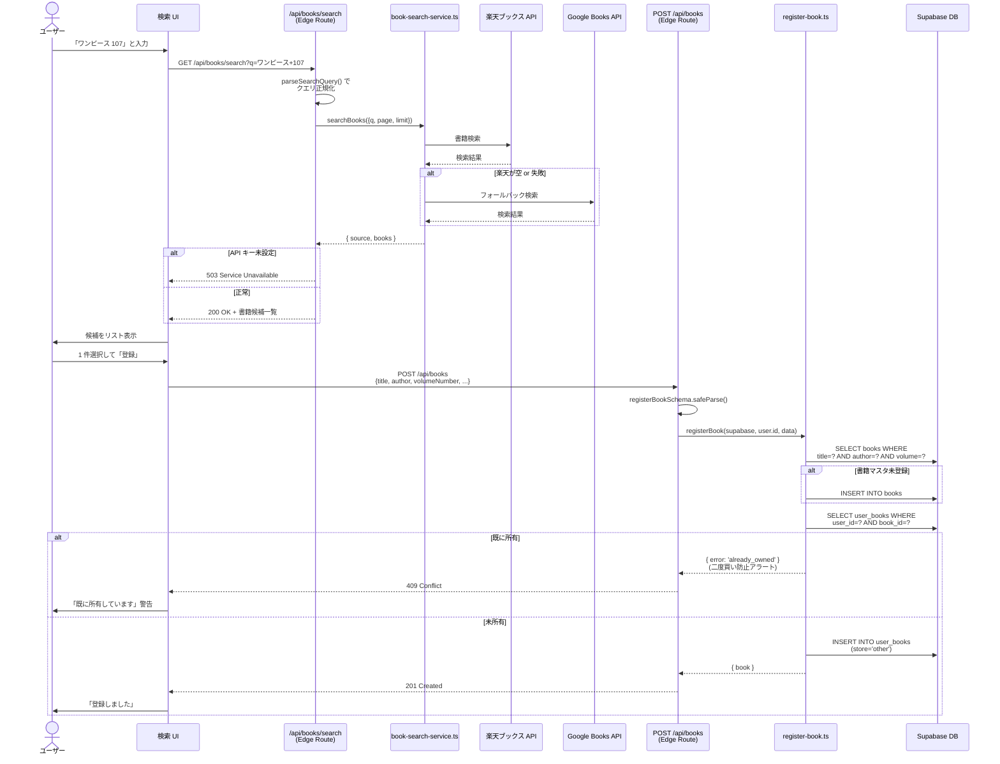

# BookHub シーケンス図

<!-- AUTO-GENERATED: Last updated 2026-04-29 from issue #30 implementation -->

主要なユースケースのシーケンス図を Mermaid 形式でまとめたドキュメント。

実装と乖離した場合はソース側を真実とし、本ドキュメントを更新すること。

**最新更新**: Issue #30 Web 本棚からの Kindle スクレイプ trigger フロー実装に伴い、セクション 2「Chrome 拡張機能のスクレイピングフロー」を全面更新。従来の自動スクレイプから Web 明示的 trigger ベースへ移行。

---

## 目次

1. [認証フロー](#1-認証フロー)
2. [Chrome 拡張機能のスクレイピングフロー](#2-chrome-拡張機能のスクレイピングフロー)
3. [本棚表示フロー](#3-本棚表示フロー)
4. [手動書籍登録フロー](#4-手動書籍登録フロー)

---

## 1. 認証フロー

ユーザーが Web アプリにログインし、その後 Chrome 拡張機能がそのセッションを利用できるようになるまでの流れ。

Supabase Auth は PKCE フローを使用する。Web 側は cookie ベースのセッション、拡張機能側は `chrome.storage.local` にアクセストークンを保存する。Web から拡張機能へのトークン受け渡しには Chrome 公式の `externally_connectable` + `chrome.runtime.sendMessage` を用いる。

### ポイント

- **PKCE コード交換**: `apps/web/app/auth/callback/route.ts` で `exchangeCodeForSession` を実行し、セッションを cookie に保存
- **`ExtensionTokenBridge`**: `apps/web/components/auth/extension-token-bridge.tsx` は Client Component で、`app/(protected)/layout.tsx` に配置される。`useEffect` 内で `getSession()` による初期同期と `onAuthStateChange` 購読を行う
- **Chrome 公式経路**: 拡張機能は Supabase の cookie を直接読めないため、`externally_connectable.matches` に登録された Web オリジンからの `chrome.runtime.sendMessage` で通信する
- **オリジン検証**: Background の `handleExternalMessage` は `sender.origin` を `__ALLOWED_EXTERNAL_ORIGINS__` (vite define 経由で注入) で厳密一致検証する
- **トークン保存**: `chrome.storage.local` に保存し、拡張機能 reload / ブラウザ再起動を跨いで保持される。Supabase access token は 1 時間で失効するため、ディスク漏洩時の悪用期間は限定的
- **`TOKEN_REFRESHED` での再送**: Supabase の自動トークン更新時も Bridge が検知して拡張機能側を最新化する
- **ブラウザ互換**: `sendTokenToExtension` は `chrome` 未定義 (Firefox/Safari/SSR) や拡張機能未インストール時は no-op で安全にスキップする
- **Extension ID 固定化**: CRXJS の `publicKey` オプション (`CRX_PUBLIC_KEY` 環境変数経由) で dev/staging の Extension ID を固定し、Web アプリ側の `NEXT_PUBLIC_EXTENSION_ID` と一致させる

---

## 2. Chrome 拡張機能のスクレイピングフロー

ユーザーが Web 本棚の「Kindle から取り込み」ボタンを押下して、Content Script がページ内の書籍データを抽出し、API 経由で DB に保存するフロー。

Web 側が明示的に `TRIGGER_SCRAPE` メッセージを送信することで、Background が背景タブで Kindle 購入履歴ページを開く。Content Script は `chrome.storage.session` の trigger flag を確認した場合のみスクレイプを実行する（手動ページ訪問では実行されない）。Kindle ページは `?pageNumber=N` クエリで完全ナビゲーションするため、Content Script は各ページ遷移で再起動される。`chrome.storage.local` の `bookhub_scrape_session_v1` に進行状態を保存し、複数ページの書籍を累積してから 1 回の API 呼び出しで送信する。

### ポイント

- **Web 本棚からの明示的トリガー**: `/bookshelf` 画面の「Kindle から取り込み」ボタン (KindleImportButton) を押下 → `triggerKindleScrape()` → `chrome.runtime.sendMessage()` で `TRIGGER_SCRAPE` を Background へ送信
- **trigger flag ライフサイクル**: Background が `chrome.storage.session` に `bookhub_kindle_trigger` フラグを書込 → Content Script で flag を読み込んでスクレイプ実行判定 → 完了 / エラー時に Background が flag を clear。flag は session 領域なので拡張機能 reload で消去されるが、設定時に `setAccessLevel({ accessLevel: 'TRUSTED_AND_UNTRUSTED_CONTEXTS' })` でアクセス制御を開放し、Content Script から読めるようにする
- **孤児フラグ自動回収**: ユーザーがトリガータブを手動で閉じた場合、Background の `chrome.tabs.onRemoved` リスナーが flag と TTL を確認し、必要に応じて cleanup (`clearKindleScrapeTrigger`, `setLastSyncResult` status=error)
- **手動訪問との区別**: trigger flag がない時は Content Script が early return し、console に `'no active trigger, skipping (manual visit)'` ログを出す。これにより Kindle ページの手動訪問ではスクレイプが走らないことを保証
- **trigger TTL**: `TRIGGER_TTL_MS` (10 分) を超えた flag は孤児と見做す。content script と background の双方がこの値で timeout をチェックし、一方が失敗した際の保護となる
- **ABORT_SCRAPE メッセージ**: Content Script が完走不可（例: DOM 待機タイムアウト、書籍なし等）と判定した場合、内部メッセージ `{ type: 'ABORT_SCRAPE', reason: 'NO_DOM' | 'NO_BOOKS' | 'UNEXPECTED_ERROR' }` を Background に送信。Background は reason を `ABORT_REASON_MESSAGES` でホワイトリスト検証してから `lastSyncResult.error` に記録する
- **manifest.config.ts** の `matches` で `contentlist/booksAll/*` に絞っており、それ以外のページでは Content Script は実行されない
- **`parser.ts` および `scrape-session.ts`** は DOM 非依存の純粋関数で、ユニットテスト容易性を確保
- **バリデーション 3 重**: Content Script 層（`scrapeBooks()` → `parseBooks()`）・Background 層（`handleSendScrapedBooks()` → `scrapePayloadSchema.safeParse()`）・API 層（`scrapeResponseSchema.safeParse()`）で順次実行。信頼境界は API 層
- **ページネーション中にタブ閉じ**: ユーザーが取り込み途中のタブを手動で閉じた場合、既存セッションが 5 分以内に再度訪問で復帰可能（`tabs.onRemoved` で cleanup 記録されるが、session は local 領域に残る）。5 分超で破棄
- **セーフティ**: 累積 500 冊または 50 ページ到達で強制送信 (`scrapePayloadSchema.books.max(500)` と一致)。これを超えるページが存在する場合は複数回送信に分割される
- **error パターン**: AUTH_ERROR / NETWORK_ERROR 時はセッションを保持して、ログイン後の再訪で再送可能。UNKNOWN_ERROR （DOM 待機失敗等）は ABORT_SCRAPE で記録
- **SyncResult 後方互換拡張**: `errorCode`, `trigger`, `startedAt`, `durationMs`, `pagesScraped`, `store` を optional フィールドとして追加。旧データはこれらなしで保存されており、読み込み時に undefined として扱われる
- **同期完了後リロード**: 完了時に `chrome.tabs.reload()` で本棚タブを自動リロードし、UI を最新化する
- **レート制限**: Edge Runtime はステートレスのため Cloudflare WAF 側で設定する

### エラーパターン

| エラー条件                     | コード                | 記録場所        | 説明                                                        |
| ------------------------------ | --------------------- | --------------- | ----------------------------------------------------------- |
| Web 側の trigger race          | `ALREADY_IN_PROGRESS` | externalMessage | 別の trigger が進行中。Web UI に「既に進行中」警告          |
| trigger message 形式不正       | `INVALID_MESSAGE`     | externalMessage | Zod スキーマバリデーション失敗                              |
| 送信元オリジン未許可           | `INVALID_ORIGIN`      | externalMessage | sender.origin が허용 목录에 없음                            |
| アクセストークンなし           | `AUTH_ERROR`          | lastSyncResult  | Background がトークン未取得で拒否                           |
| API が 401 Unauthorized        | `AUTH_ERROR`          | lastSyncResult  | トークン有効期限切れまたはサーバー側認証エラー              |
| DOM 要素待機タイムアウット     | `UNKNOWN_ERROR`       | lastSyncResult  | Content Script が ABORT_SCRAPE で報告（reason: NO_DOM）     |
| スクレイプ対象の書籍なし       | `UNKNOWN_ERROR`       | lastSyncResult  | Content Script が ABORT_SCRAPE で報告（reason: NO_BOOKS）   |
| Zod バリデーション失敗         | `VALIDATION_ERROR`    | lastSyncResult  | Content Script / Background 層の payload 検証失敗           |
| API が 400 Bad Request         | `VALIDATION_ERROR`    | lastSyncResult  | API 側のリクエストバリデーション失敗                        |
| API が 5xx                     | `API_ERROR`           | lastSyncResult  | サーバーエラー                                              |
| `fetch` 失敗                   | `NETWORK_ERROR`       | lastSyncResult  | ネットワーク接続エラー（再試行可能）                        |
| trigger flag TTL 超過          | `UNKNOWN_ERROR`       | lastSyncResult  | Content Script / Background が TTL チェックで期限切れ判定   |
| トリガータブが手動で閉じられた | `UNKNOWN_ERROR`       | lastSyncResult  | tabs.onRemoved で回収、error メッセージ「タブが閉じられた」 |

---

## 3. 本棚表示フロー

ユーザーが Web アプリの本棚ページを開いて、自分の蔵書を一覧表示するまでの流れ。

### ポイント

- Server Component (RSC) からの fetch なので `cookie` ベースのセッション情報を使用
- Supabase の Row Level Security により、`user_books.user_id = auth.uid()` のレコードのみ取得される（API 層でユーザー ID をフィルタする必要がない）
- クエリパラメータでタイトル/著者検索・ストアフィルタ・ページネーションをサポート

---

## 4. 手動書籍登録フロー

ユーザーが書籍名で検索し、楽天ブックス API / Google Books API の結果から手動で蔵書に追加するフロー。

### ポイント

- 検索は楽天ブックス API を第一優先、Google Books API をフォールバックとする
- API キー未設定は内部設定の問題なので、設定情報を漏洩させないよう 503 で返す
- 手動登録時の `store` は `other` 固定（Kindle/DMM はスクレイピング経由のみ）
- 二度買い防止アラートは 409 Conflict で返却し、UI 側で警告表示

---

## 更新ルール

- API エンドポイント・メッセージ型・DB スキーマを変更した場合、対応するシーケンス図を更新すること
- 新しいユースケース（フェーズ 2 の通知機能など）は新しいセクションとして追加すること
- 図の中で参照するファイル名は、リファクタリング時に grep で検出できるよう正確に書くこと
