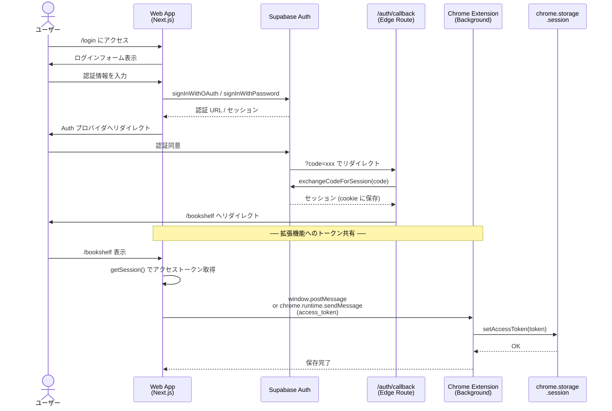
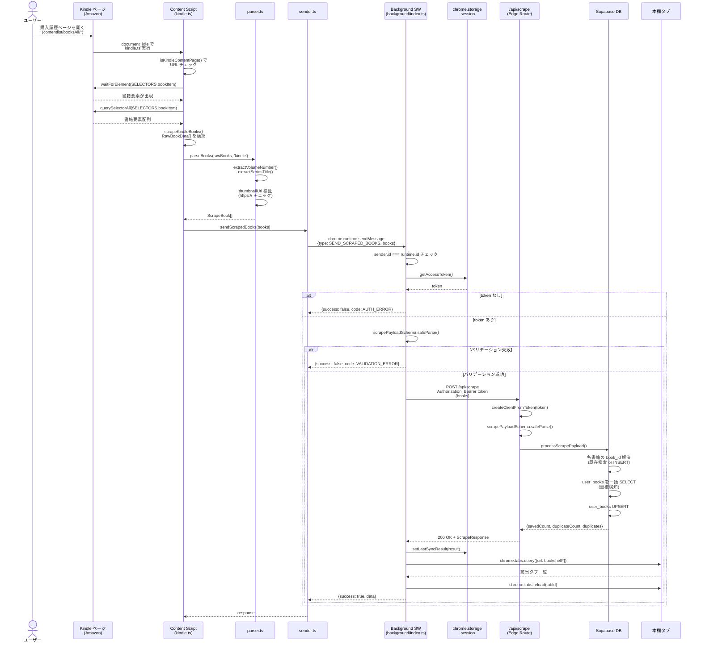
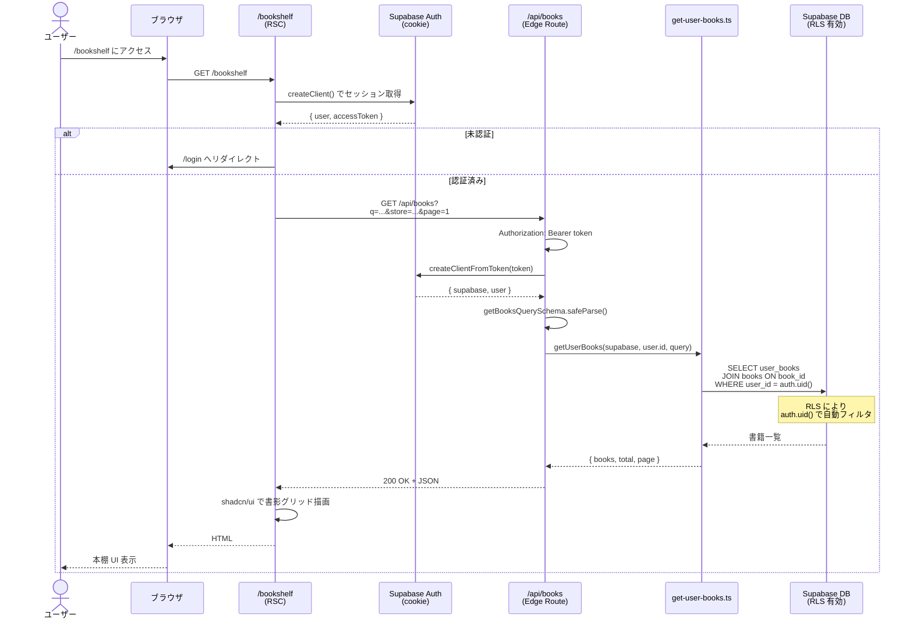
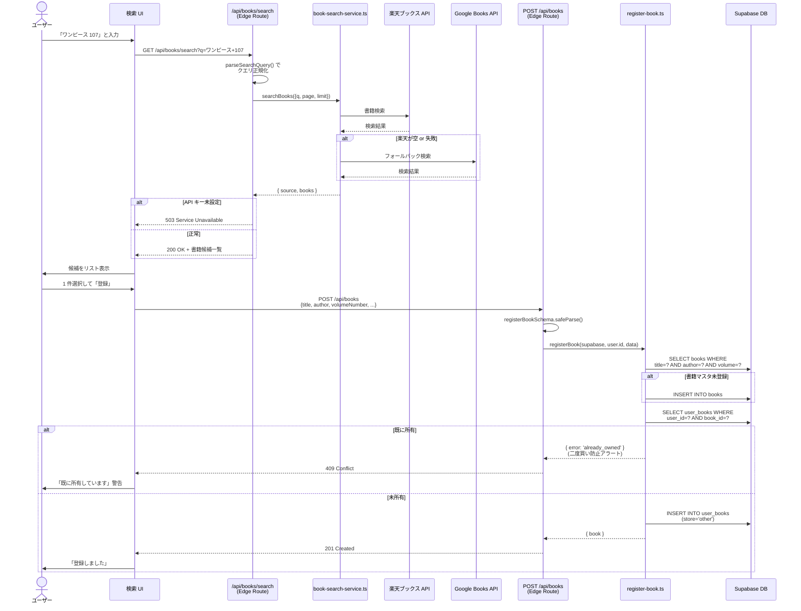

# BookHub シーケンス図

主要なユースケースのシーケンス図を Mermaid 形式でまとめたドキュメント。

実装と乖離した場合はソース側を真実とし、本ドキュメントを更新すること。

---

## 目次

1. [認証フロー](#1-認証フロー)
2. [Chrome 拡張機能のスクレイピングフロー](#2-chrome-拡張機能のスクレイピングフロー)
3. [本棚表示フロー](#3-本棚表示フロー)
4. [手動書籍登録フロー](#4-手動書籍登録フロー)

---

## 1. 認証フロー

ユーザーが Web アプリにログインし、その後 Chrome 拡張機能がそのセッションを利用できるようになるまでの流れ。

Supabase Auth は PKCE フローを使用し、Web 側は cookie ベースのセッション、拡張機能側は `chrome.storage.session` にアクセストークンを保存する。

### ポイント

- `apps/web/app/auth/callback/route.ts` で PKCE の `code` を `exchangeCodeForSession` に渡し、セッションを cookie に保存する
- 拡張機能は Supabase の cookie を直接読み取れないため、Web App 側からアクセストークンを受け渡してもらう必要がある
- トークンは `chrome.storage.session` に保存され、ブラウザ終了時にクリアされる（永続化しない）

---

## 2. Chrome 拡張機能のスクレイピングフロー

ユーザーが Kindle の購入履歴ページを開いたときに、Content Script がページ内の書籍データを抽出し、API 経由で DB に保存するフロー。

### ポイント

- `manifest.config.ts` の `matches` で `contentlist/booksAll/*` に絞っており、それ以外のページでは Content Script は実行されない
- `parser.ts` は DOM 非依存の純粋関数で、テストしやすい設計
- バリデーションは Content Script 層・Background 層・API 層の 3 重で行う（信頼境界は API 層）
- 同期完了後に `chrome.tabs.reload` で本棚タブを自動リロードし、UI を最新化する
- レート制限は Edge Runtime ではステートレスのため Cloudflare WAF 側で設定する

### エラーパターン

| エラー条件             | コード             | レスポンス              |
| ---------------------- | ------------------ | ----------------------- |
| アクセストークンなし   | `AUTH_ERROR`       | Background が即座に拒否 |
| API が 401             | `AUTH_ERROR`       | 「再ログインが必要」    |
| Zod バリデーション失敗 | `VALIDATION_ERROR` | 詳細メッセージ          |
| API が 400             | `VALIDATION_ERROR` | サーバー側エラー        |
| API が 5xx             | `API_ERROR`        | サーバーエラー          |
| `fetch` 失敗           | `NETWORK_ERROR`    | ネットワークエラー      |

---

## 3. 本棚表示フロー

ユーザーが Web アプリの本棚ページを開いて、自分の蔵書を一覧表示するまでの流れ。

### ポイント

- Server Component (RSC) からの fetch なので `cookie` ベースのセッション情報を使用
- Supabase の Row Level Security により、`user_books.user_id = auth.uid()` のレコードのみ取得される（API 層でユーザー ID をフィルタする必要がない）
- クエリパラメータでタイトル/著者検索・ストアフィルタ・ページネーションをサポート

---

## 4. 手動書籍登録フロー

ユーザーが書籍名で検索し、楽天ブックス API / Google Books API の結果から手動で蔵書に追加するフロー。

### ポイント

- 検索は楽天ブックス API を第一優先、Google Books API をフォールバックとする
- API キー未設定は内部設定の問題なので、設定情報を漏洩させないよう 503 で返す
- 手動登録時の `store` は `other` 固定（Kindle/DMM はスクレイピング経由のみ）
- 二度買い防止アラートは 409 Conflict で返却し、UI 側で警告表示

---

## 更新ルール

- API エンドポイント・メッセージ型・DB スキーマを変更した場合、対応するシーケンス図を更新すること
- 新しいユースケース（フェーズ 2 の通知機能など）は新しいセクションとして追加すること
- 図の中で参照するファイル名は、リファクタリング時に grep で検出できるよう正確に書くこと
